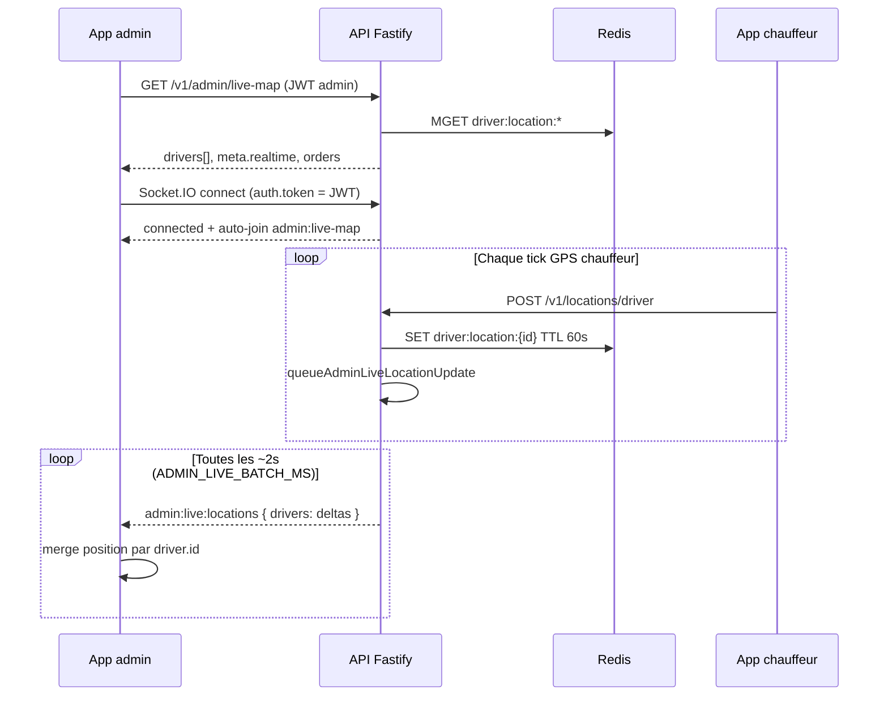

# Carte admin live — HTTP `live-map` + Socket.IO temps réel

Guide d’intégration pour afficher les **chauffeurs en ligne** sur la carte admin, avec snapshot initial via REST et mises à jour GPS via **Socket.IO**.

**Environnement dev :** `https://api.upjunoo-dev.tech`  
**Exemple demandé :**  
`GET /v1/admin/live-map?includeWithoutLocation=true`

---

## 1. Principe : deux canaux complémentaires

| Canal | Rôle | Quand l’utiliser |
|-------|------|------------------|
| **HTTP** `GET /v1/admin/live-map` | **Snapshot complet** : profils chauffeurs, statuts, positions Redis, commandes actives, bloc `meta.realtime` | **Une fois** à l’ouverture de l’écran carte (ou fallback si socket coupé) |
| **Socket.IO** event `admin:live:locations` | **Deltas GPS** uniquement (lat/lng, cap, vitesse) par batch ~2 s | Tant que l’écran carte est affiché |

Le socket **ne remplace pas** le GET initial : il ne renvoie pas `driverCode`, `profile`, `rideCategoryCode`, etc. Le front doit **fusionner** les deltas sur les marqueurs créés depuis la réponse HTTP.



---

## 2. Authentification (HTTP et socket)

Les deux canaux exigent le **même JWT admin** (`accessToken` après login), **pas** la clé Supabase anon.

| Méthode (dev) | Route |
|---------------|-------|
| Sandbox | `POST /v1/dev/login` body `{ "role": "admin" }` |
| Login admin | `POST /v1/auth/admin/login` ou `POST /v1/auth/login` |

**HTTP :** en-tête `Authorization: Bearer <accessToken>`

**Socket.IO :** à la connexion :

```typescript
auth: { token: accessToken }  // JWT commençant par eyJ…
```

Alternatives acceptées côté serveur : query `?token=…` ou header `Authorization` au handshake.

Rôles reconnus comme admin : `user_type` `ADMIN` / `SUPER_ADMIN`, ou rôle actif `ADMIN`, `SUPER_ADMIN`, `OPS_ADMIN`.

---

## 3. Route snapshot — `GET /v1/admin/live-map`

### URL complète (dev)

```
GET https://api.upjunoo-dev.tech/v1/admin/live-map?includeWithoutLocation=true
Authorization: Bearer <accessToken>
```

### Query parameters

| Paramètre | Défaut | Description |
|-----------|--------|-------------|
| `includeWithoutLocation` | `false` | Si `true` (ou `1`), inclut les chauffeurs **en ligne** sans position GPS récente dans Redis (`location: null`, `isTracked: false`). |
| `include_without_location` | — | Alias snake_case du paramètre ci-dessus. |
| `maxLocationAgeSeconds` | `60` | Âge maximum de la dernière position pour la considérer « fraîche » (borné entre 5 et 120). Aligné sur le TTL cache Redis (60 s). |
| `max_location_age_seconds` | — | Alias snake_case. |

### Critères métier (côté serveur)

1. Chauffeurs Supabase avec `availability_status` ∈ `online`, `available` (max **200**, tri `last_online_at`).
2. Pour chaque id, lecture Redis clé `driver:location:{driverId}` (remplie par `POST /v1/locations/driver`, TTL **60 s**).
3. Position « fraîche » si `ageSeconds <= maxLocationAgeSeconds`.
4. Inclusion dans `drivers[]` si position fraîche **ou** `includeWithoutLocation=true`.

### Corps de réponse (enveloppe API)

```json
{
  "status": "ok",
  "generatedAt": "2026-06-04T12:00:00.000Z",
  "drivers": [ /* voir ci-dessous */ ],
  "meta": { /* compteurs + realtime */ },
  "orders": {
    "rides": [ /* courses actives */ ],
    "deliveries": [ /* livraisons actives */ ]
  }
}
```

### Objet chauffeur (HTTP)

```json
{
  "id": "uuid-driver",
  "userId": "uuid-user",
  "driverCode": "DRV-…",
  "availabilityStatus": "online",
  "approvalStatus": "approved",
  "rideCategoryCode": "CONFORT",
  "ratingAvg": 4.8,
  "lastOnlineAt": "2026-06-04T11:58:00.000Z",
  "profile": {
    "id": "uuid-profile",
    "displayName": "Jean K.",
    "phone": "+225…",
    "email": "driver@…"
  },
  "location": {
    "latitude": 5.3599,
    "longitude": -3.9876,
    "heading": 120,
    "speedKmh": 35,
    "accuracyM": 8,
    "recordedAt": "2026-06-04T12:00:00.000Z",
    "source": "APP",
    "ageSeconds": 8
  },
  "isTracked": true
}
```

Avec `includeWithoutLocation=true`, un chauffeur sans GPS récent peut apparaître ainsi :

```json
{
  "id": "uuid-driver",
  "driverCode": "DRV-…",
  "availabilityStatus": "available",
  "location": null,
  "isTracked": false
}
```

### Bloc `meta` (indispensable pour le socket)

```json
{
  "generatedAt": "2026-06-04T12:00:00.000Z",
  "onlineInDatabase": 42,
  "withRecentLocation": 18,
  "maxLocationAgeSeconds": 60,
  "locationCacheTtlSeconds": 60,
  "includeWithoutLocation": true,
  "realtime": {
    "transport": "socket.io",
    "url": "wss://api.upjunoo-dev.tech",
    "room": "admin:live-map",
    "event": "admin:live:locations",
    "batchIntervalMs": 2000,
    "joinPayload": { "room": "admin:live-map" },
    "auth": { "token": "<accessToken JWT admin>" },
    "persistent": true,
    "serverKeepAlive": { "pingIntervalMs": 25000, "pingTimeoutMs": 60000 },
    "clientOptions": {
      "reconnection": true,
      "reconnectionAttempts": null,
      "reconnectionDelay": 1000,
      "reconnectionDelayMax": 10000,
      "timeout": 45000,
      "transports": ["websocket", "polling"]
    },
    "notes": [ "…" ]
  }
}
```

Utiliser **`meta.realtime`** tel quel pour configurer le client Socket.IO (URL, event, room, options).

### Routes HTTP proches

| Route | Contenu |
|-------|---------|
| `GET /v1/admin/live-map` | `drivers` + `meta` + `orders` |
| `GET /v1/admin/live-drivers` | `drivers` + `meta` uniquement (mêmes query params) |
| `GET /v1/admin/live-orders` | `orders` uniquement |

---

## 4. Alimentation GPS (côté chauffeur)

Sans tick GPS, la carte admin ne bouge pas.

| Route | Auth | Effet |
|-------|------|--------|
| `POST /v1/locations/driver` | JWT **chauffeur** | Insert historique Supabase + cache Redis 60 s + file broadcast admin |

Body typique :

```json
{
  "latitude": 5.36,
  "longitude": -3.98,
  "heading": 90,
  "speedKmh": 40,
  "accuracyM": 10,
  "recordedAt": "2026-06-04T12:00:00.000Z",
  "source": "APP"
}
```

**Dev — simulateur :** `POST /v1/dev/simulate/locations-tick` (sandbox + clé simu) reprend le même pipeline. Voir `docs/DEV-DRIVER-SIMULATOR.md`.

---

## 5. Socket.IO — connexion et rooms

### URL

Même host que l’API, schéma WebSocket :

- API `https://api.upjunoo-dev.tech` → socket `wss://api.upjunoo-dev.tech`
- Client : **socket.io-client v4**

### Événements émis par le client

| Event | Payload | Usage |
|-------|---------|--------|
| `join` | `{ "room": "admin:live-map" }` | Rejoindre la room live map (optionnel si admin : voir ci-dessous) |

### Événements reçus du serveur

| Event | Quand | Payload |
|-------|-------|---------|
| `connected` | À chaque connexion / reconnexion | `{ service, timestamp, authenticated, isAdmin, adminLiveAutoJoined }` |
| `joined` | Après join réussi (ou auto-join admin) | `{ room: "admin:live-map", persistent: true }` |
| `join_denied` | Join room admin sans droits | `{ room, code: "ADMIN_REQUIRED", message }` |
| **`admin:live:locations`** | Batch périodique (~2 s) si des GPS ont bougé | Voir § 6 |

**Auto-join admin :** si le JWT est admin, le serveur place déjà le socket dans `admin:live-map` et `adminLiveAutoJoined: true`. Le `emit('join', …)` reste utile en secours ou pour clarifier les logs.

### Autres rooms (hors live-map)

Le même serveur gère `join` avec `{ driverUserId }` ou `{ orderId }` pour dispatch / suivi course — **non utilisées** pour la carte admin globale.

---

## 6. Event temps réel — `admin:live:locations`

Émis uniquement vers la room `admin:live-map`, par batch (défaut **2000 ms**, variable serveur `ADMIN_LIVE_BATCH_MS`, min 500 ms, max 10 s).

**Important :** le payload socket est un **delta position**, pas un chauffeur complet.

```json
{
  "at": "2026-06-04T12:00:02.000Z",
  "count": 3,
  "drivers": [
    {
      "id": "uuid-driver",
      "latitude": 5.3601,
      "longitude": -3.9870,
      "heading": 118,
      "speedKmh": 36,
      "recordedAt": "2026-06-04T12:00:01.500Z",
      "ageSeconds": 1
    }
  ]
}
```

- Un chauffeur n’apparaît dans le batch que s’il a envoyé au moins un `POST /locations/driver` depuis le dernier flush.
- Plusieurs ticks du même chauffeur entre deux flush sont **dédupliqués** (dernière position gardée).
- Si aucun mouvement GPS, **aucun** event n’est envoyé (pas de heartbeat vide).

### Event obsolète

Ne pas écouter `driver:location_updated` (remplacé par le batch room admin).

---

## 7. Stratégie front recommandée

### Avec `includeWithoutLocation=true`

1. **GET** `live-map?includeWithoutLocation=true` → construire tous les marqueurs :
   - `isTracked: true` + `location` → marker sur la carte ;
   - `isTracked: false` → marker grisé / hors carte / liste « sans GPS » selon UX.
2. **Socket** → pour chaque delta, si `id` existe déjà :
   - mettre à jour `location` et passer `isTracked: true` ;
   - si `id` inconnu (nouveau online + premier GPS), option : **re-fetch** léger `live-map` ou ignorer jusqu’au prochain refresh.
3. Ne **pas** supprimer un chauffeur « sans GPS » du seul fait qu’il n’est pas dans un batch socket.

### Fusion delta (exemple)

```typescript
import { io, Socket } from 'socket.io-client';

const API = 'https://api.upjunoo-dev.tech';

type DriverMarker = {
  id: string;
  driverCode?: string;
  profile?: { displayName?: string };
  location: {
    latitude: number;
    longitude: number;
    heading: number | null;
    speedKmh: number | null;
    recordedAt: string;
    ageSeconds: number;
  } | null;
  isTracked: boolean;
};

async function initLiveMap(accessToken: string) {
  const res = await fetch(
    `${API}/v1/admin/live-map?includeWithoutLocation=true`,
    { headers: { Authorization: `Bearer ${accessToken}` } },
  );
  const body = await res.json();
  const { drivers, meta, orders } = body;
  const rt = meta.realtime;

  const byId = new Map<string, DriverMarker>(
    drivers.map((d: DriverMarker) => [d.id, { ...d }]),
  );

  renderDrivers([...byId.values()]);
  renderOrders(orders);

  const socket: Socket = io(rt.url, {
    ...rt.clientOptions,
    auth: { token: accessToken },
  });

  socket.on('connect', () => {
    if (!meta.realtime) return;
    // Optionnel si adminLiveAutoJoined déjà true
    socket.emit('join', rt.joinPayload);
  });

  socket.on(rt.event, (payload: { at: string; count: number; drivers: Array<{
    id: string;
    latitude: number;
    longitude: number;
    heading: number | null;
    speedKmh: number | null;
    recordedAt: string;
    ageSeconds: number;
  }> }) => {
    for (const delta of payload.drivers) {
      const existing = byId.get(delta.id);
      if (!existing) continue; // ou refetch live-map
      existing.location = {
        latitude: delta.latitude,
        longitude: delta.longitude,
        heading: delta.heading,
        speedKmh: delta.speedKmh,
        recordedAt: delta.recordedAt,
        ageSeconds: delta.ageSeconds,
      };
      existing.isTracked = true;
      updateMarkerOnMap(existing);
    }
  });

  socket.on('join_denied', (err) => console.error('Live map socket denied', err));

  return { socket, byId, refetch: () => initLiveMap(accessToken) };
}
```

### JWT expiré (~15 min)

Avant expiration :

```typescript
socket.auth = { token: newAccessToken };
socket.connect();
```

Le serveur re-auto-join la room admin si le nouveau token est toujours admin.

### Fallback si socket déconnecté

`GET /v1/admin/live-map` toutes les **30–60 s** (éviter un polling agressif toutes les 5 s).

---

## 8. Récapitulatif des fichiers backend

| Fichier | Rôle |
|---------|------|
| `src/modules/admin/admin.routes.ts` | Route `GET /admin/live-map` |
| `src/modules/admin/admin.live.service.ts` | Agrégation Supabase + Redis + `meta.realtime` |
| `src/sockets/admin-live.broadcast.ts` | Batch `admin:live:locations` |
| `src/sockets/io.ts` | Serveur Socket.IO, auto-join admin |
| `src/sockets/socket-auth.ts` | JWT + rôles admin sur le socket |
| `src/modules/locations/locations.service.ts` | `POST /locations/driver` → Redis + queue broadcast |

---

## 9. Dépannage

| Symptôme | Cause probable | Action |
|----------|----------------|--------|
| `drivers[]` vide sans `includeWithoutLocation` | Aucun chauffeur online avec GPS &lt; 60 s | Activer simulateur / app chauffeur ; ou `includeWithoutLocation=true` |
| Chauffeurs listés mais carte figée | Socket non connecté ou pas admin | Vérifier `connected.isAdmin`, pas de `join_denied` |
| Snapshot OK, pas de mouvement | Pas de `POST /locations/driver` | Vérifier app chauffeur ou `locations-tick` dev |
| Positions qui disparaissent au refresh | TTL Redis 60 s dépassé | Normal si le chauffeur arrête d’envoyer le GPS |
| Batch trop lent / rapide | `ADMIN_LIVE_BATCH_MS` sur le VPS | Défaut 2000 dans `deploy/env.production.example` |

---

## 10. Voir aussi

- `docs/ADMIN-DASHBOARD-FRONTEND.md` — vue d’ensemble dashboard + extrait code
- `API_ENDPOINTS_UPJUNOO.md` — fiche endpoints admin
- `docs/DEV-DRIVER-SIMULATOR.md` — alimenter la carte en dev sans app chauffeur
